# 🔍 Project Intelligence Agent

> An investigative multi-agent AI system that analyzes scattered project artifacts and answers plain-English questions about why software projects fail.

**Kaggle 5-Day AI Agents Intensive — Vibe Coding Edition | Agents for Business Track**

---

## The Problem

When a software project is delayed or fails, a Project Manager has to manually dig through Jira tickets, Slack messages, meeting notes, and emails to figure out what went wrong. This can take hours of cross-referencing scattered artifacts just to write a post-mortem report.

**The Project Intelligence Agent does that digging automatically.**

Upload your project files, ask a question like *"Why was Project Phoenix delayed 6 weeks?"*, and get a structured post-mortem report with a reconstructed timeline, contributing factors with confidence scores, source citations, and actionable recommendations — in seconds.

---

## Features

- ✅ Multi-agent workflow — 4 specialized nodes, each with a single job
- ✅ Automatic timeline reconstruction from dates and sprint markers
- ✅ Cross-project comparison — analyze two projects side by side
- ✅ Evidence-backed reasoning — every finding cites its source document
- ✅ Confidence scoring — transparent, verifiable, not LLM opinion
- ✅ Project-aware filtering — correctly isolates findings per project
- ✅ Works on any project files — not hardcoded to demo data

---

## Built Using

- **Google ADK 2.0**
- **Gemini 2.5 Flash**
- **Streamlit**
- **Python**
- **Antigravity IDE**

---

## Demo

Three preloaded synthetic datasets included for immediate testing:

| Project | Delay | Primary Failure Patterns |
|---|---|---|
| Project Phoenix | 6 weeks | Scope creep + API blocker + sick leave |
| Project Apollo | 4 weeks | Legacy ORM debt + cloud infrastructure outage |
| Project Nebula | 5 weeks | Scope creep + payment API blocker + resource reassignment |

> **Screenshot**
> 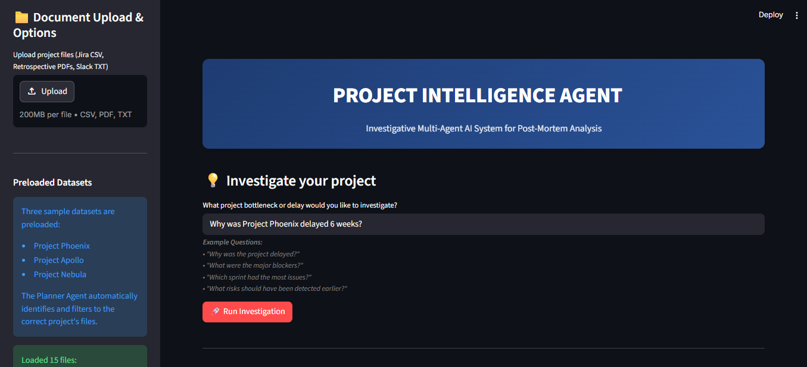
> 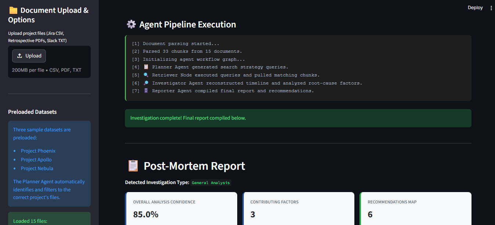

The agent automatically identifies which project is being queried and filters to only that project's files — even when all 15 files from all three projects are loaded simultaneously.

**Two modes:**
- **Single project analysis** — post-mortem report with timeline, factors, and recommendations

>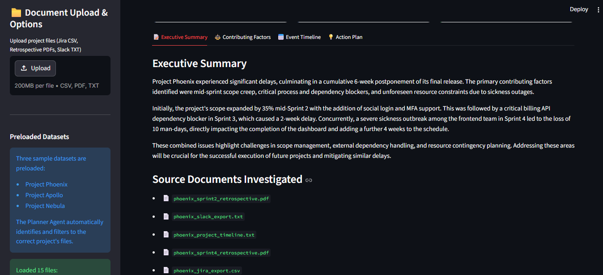
>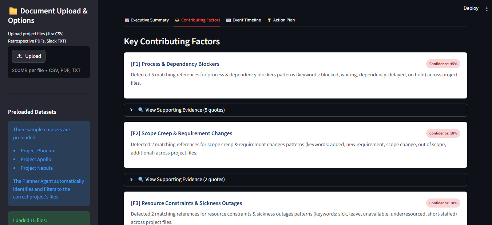
>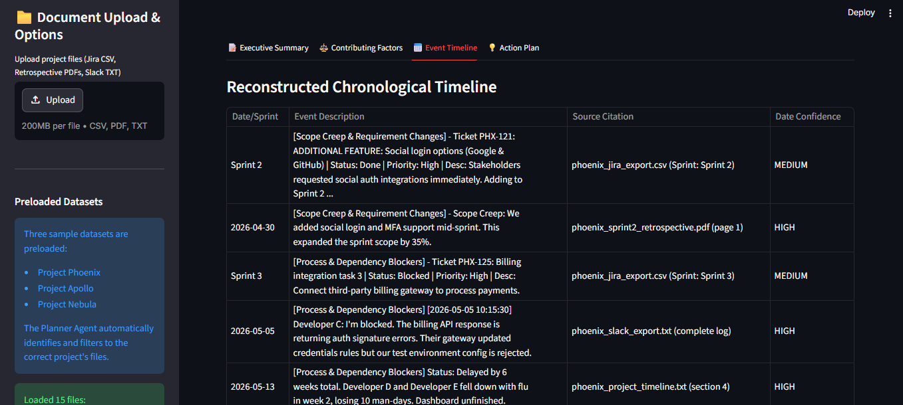
>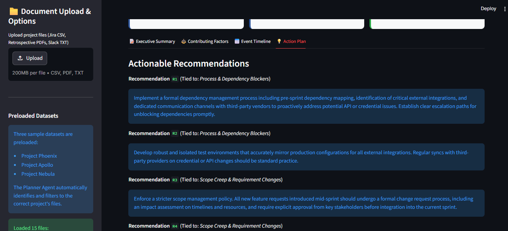

- **Cross-project comparison** — triggered by mentioning two project names in one question.

>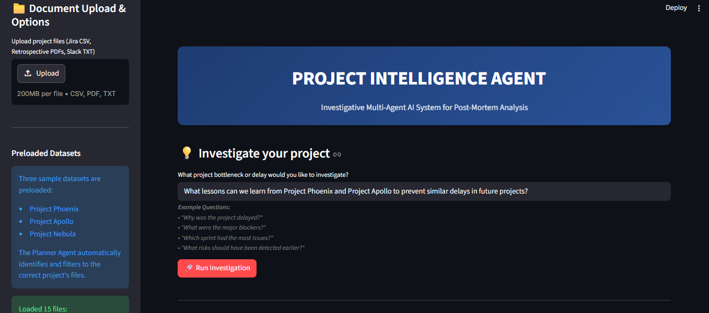
>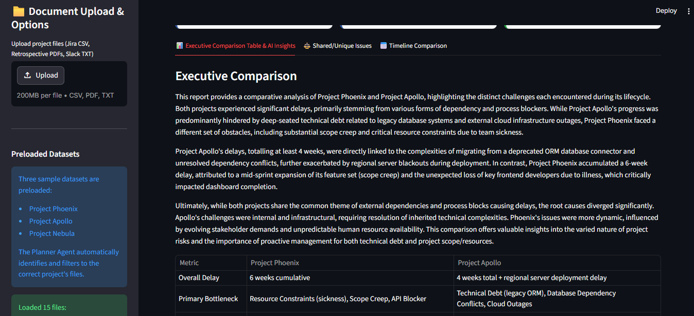
>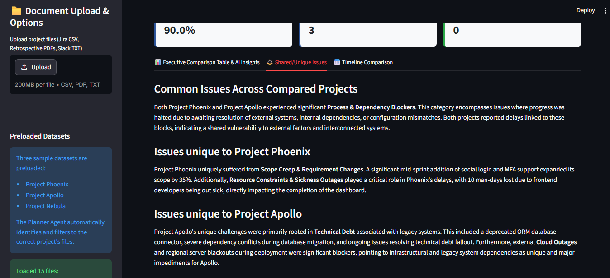
>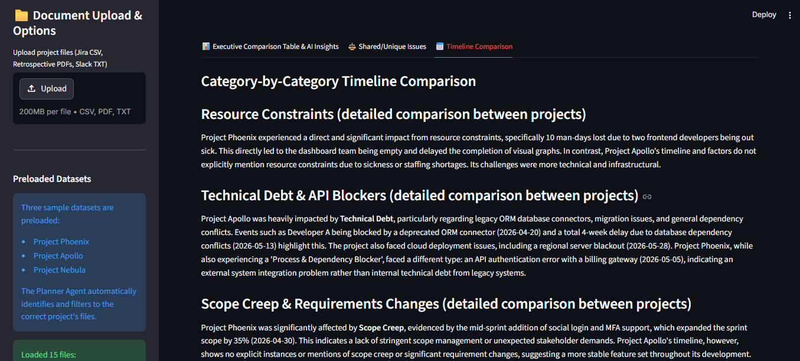

- **Three-project overview** — triggered by asking a general question with no specific project named (e.g. *"What are the common failure patterns across all projects?"*)

>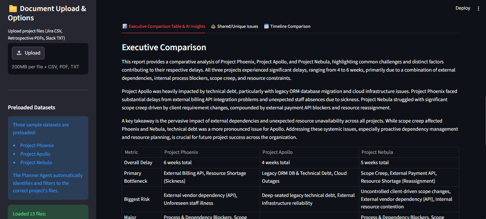
>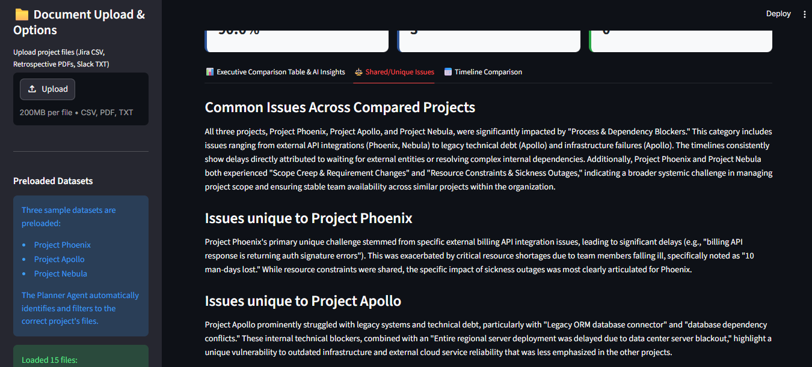
>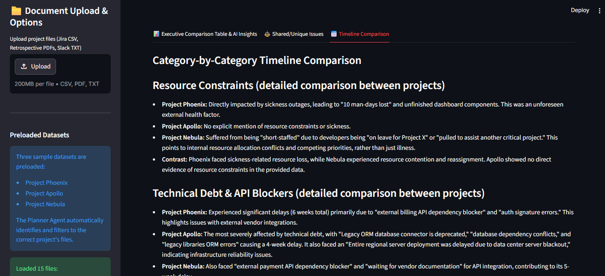


---

## Architecture

```
Project Artifacts (Jira CSV, PDFs, Slack TXT, Timeline TXT)
        │
        ▼
document_loader.py  ←── chunks files into searchable evidence pieces
        │
        ▼
┌──────────────────────────────────────────┐
│           ADK 2.0 Workflow Graph         │
│                                          │
│  1. Planner Agent    (Gemini call #1)    │
│     └─ Understands question + intent    │
│     └─ Identifies target project        │
│     └─ Generates search queries         │
│                                          │
│  2. Retriever Node   (Python)            │
│     └─ Keyword search on chunks         │
│     └─ Filters to target project files  │
│     └─ Scores and ranks evidence        │
│                                          │
│  3. Investigator Node (Python)           │
│     └─ Timeline reconstruction (regex)  │
│     └─ Contributing factor detection    │
│     └─ Confidence score calculation     │
│                                          │
│  4. Reporter Agent   (Gemini call #2)   │
│     └─ Writes executive summary         │
│     └─ Generates recommendations        │
│     └─ Produces comparison analysis     │
│                                          │
└──────────────────────────────────────────┘
        │
        ▼
Post-Mortem Report
```

**Key design decision:** Only **2 Gemini API calls** per run. The Investigator uses pure Python keyword matching — zero API cost — to reconstruct timelines and identify contributing factors. Every finding is grounded in counted evidence, not LLM interpretation.

---

## Setup

### Prerequisites
- Python 3.11+
- Google AI Studio API Key — [get one free here](https://aistudio.google.com)

### Installation

```bash
# Clone the repo
git clone https://github.com/Iniyaa-123/Project-Intelligence-Agent.git
cd Project-Intelligence-Agent

# Install dependencies
pip install -r requirements.txt

# Set up your API key
cp .env.example .env
# Open .env and replace 'your_gemini_api_key_here' with your actual key
```

### Generate the test datasets

```bash
python generate_synthetic_data.py
```

Creates all 15 synthetic project files in the `data/` folder.

### Run the app

```bash
streamlit run app.py
```

Open your browser to `http://localhost:8501`

### Test without the UI

```bash
# Check all imports and graph structure — no API calls needed
python test_compilation.py

# Run the full pipeline with a test question — uses 2 API calls
python test_query.py
```

---

## File Structure

```
Project-Intelligence-Agent/
├── app.py                      # Streamlit web UI
├── agents_workflow.py          # ADK 2.0 multi-agent pipeline
├── models.py                   # Pydantic output schemas
├── document_loader.py          # File ingestion and chunking
├── search_tool.py              # Keyword search and scoring
├── generate_synthetic_data.py  # Creates test datasets
├── requirements.txt            # Python dependencies
├── test_compilation.py         # Validates imports and graph
├── test_query.py               # End-to-end pipeline test
├── .env.example                # API key template
└── .gitignore
```

---

## Security

- API key loaded from `.env` — never hardcoded in source
- API key validated on startup with clear error messaging
- User queries sanitized to strip prompt injection attempts
- File uploads validated for extension and size before processing
- `.env` excluded from version control

---

## Kaggle Rubric Coverage

| Requirement | Implementation |
|---|---|
| Agent / Multi-agent system (ADK) | 4-node ADK 2.0 Workflow — 2 LlmAgent nodes + 2 Python nodes, Pydantic schemas, ctx.state passing |
| Security features | API key validation, input sanitization, file type/size validation |
| Antigravity | Project built and iteratively refined in Antigravity IDE throughout the 5-day build |

---

*Author: Iniyaa*
*Built for Kaggle 5-Day AI Agents Intensive (2026)*
